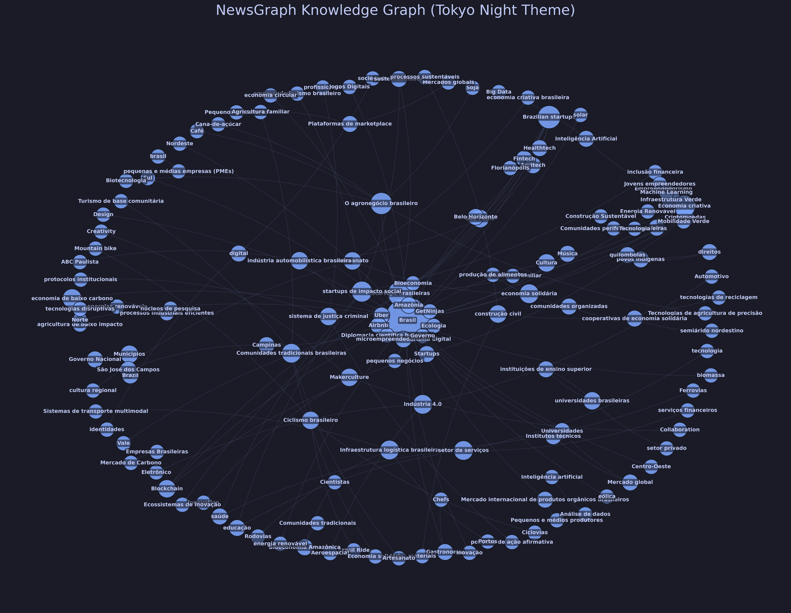

<div align="center">
  
  
  <h1>
    
  </h1>
  
  <samp>Structure Unstructured Data · GraphRAG Ready · Local Privacy</samp>
  <br/><br/>
  
  
  
  
  
  
</div>

<br/>


## `> tech_stack`

<div align="center">
  
</div>

<table align="center">
<tr>
<td align="center" width="33%">
<strong>⚙️ Core Engine</strong><br/><br/>


</td>
<td align="center" width="33%">
<strong>🕸️ Data & Graph</strong><br/><br/>


</td>
<td align="center" width="33%">
<strong>🧠 AI & Extraction</strong><br/><br/>


</td>
</tr>
</table>

<br/>

## `> architecture_overview`

```
newsgraph/
│
├── 🐍 src/                    # Python Source Code
│   ├── ingestion.py           # CSV Loading & pre-processing
│   ├── llm_extraction.py      # Prompt Engineering & JSON Parsing
│   ├── graph_builder.py       # Neo4j Driver & Cypher Injection
│   ├── visualize.py           # NetworkX/Matplotlib Visualization
│   └── stats.py               # Statistical Analysis
│
├── 🐳 docker-compose.yml      # Neo4j Infrastructure
├── 📄 requirements.txt        # Python Dependencies
└── 📓 main.py                 # Orchestration Pipeline
```

<br/>

## `> workflow_pipeline`

<table align="center">
<tr>
<td width="50%">
<h3 align="center">📥 Phase 1: Ingestion</h3>
<p align="center">

</p>

**Input:** Raw CSV Dataset (319 Articles)
**Process:**
1. Clean text (remove artifacts)
2. Filter valid categories
3. Batch processing preparation

</td>
<td width="50%">
<h3 align="center">🧠 Phase 2: AI Extraction</h3>
<p align="center">

</p>

**Process:**
1. Prompt Llama 3 with rigorous JSON schema
2. Extract Entities (Person, Org, Location, Concept)
3. Extract Relationships (VERB_BASED)
4. Handle LLM hallucinations/formatting errors

</td>
</tr>
<tr>
<td width="50%">
<h3 align="center">🟢 Phase 3: Graph Construction</h3>
<p align="center">

</p>

**Technology:** Neo4j (Bolt Protocol)
**Logic:**
- `MERGE` nodes to avoid duplicates
- Connect entities with directional relationships
- Assign categories as Node Labels

</td>
<td width="50%">
<h3 align="center">📊 Phase 4: Viz & Stats</h3>
<p align="center">

</p>

**Output:** High-res Generation
**Stats:**
- **907** Unique Nodes
- **755** Semantic Relationships
- **Tokyo Night** Themed Visualization

</td>
</tr>
</table>

<br/>

## `> graph_statistics`

<div align="center">


</div>

**Top Connected Entities:**
1. **Brasil** (Location) - *Hub Central*
2. **Tecnologia** (Concept) - *Cross-cutting theme*
3. **Economia** (Concept)
4. **Startups** (Organization)

**Visualization Preview:**
<div align="center">
  
</div>

<br/>

## `> installation`

```bash
# 1. Clone the repository
git clone https://github.com/takaokensei/newsgraph.git
cd newsgraph

# 2. Start Infrastructure (Neo4j)
docker-compose up -d

# 3. Install Dependencies
pip install -r requirements.txt

# 4. Setup Local LLM (Ollama)
ollama serve
ollama pull llama3

# 5. Run the Pipeline
python main.py
```

<br/>

## `> contact`

<div align="center">
  
  <strong>Cauã Vitor (takaokensei)</strong>
  <br/>
  <samp>AI Engineer & Researcher</samp>
  <br/>
  <samp>UFRN - Electrical Engineering</samp>
  
  <br/><br/>
  
  <a href="https://github.com/takaokensei">
    
  </a>
</div>

<br/>

<div align="center">
  
  
  
</div>


