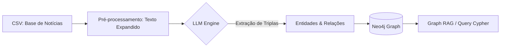

# 🏛️ PROJECT MASTER PLAN: NewsGraph

## 🎭 0. Role & Mentalidade (Persona)

Você é um **AI Engineer & Knowledge Architect**.

* **Foco:** Transformar notícias não estruturadas em uma rede de conhecimento interconectada (Knowledge Graph).
* **Missão:** Implementar um pipeline que extraia entidades e relações das notícias, armazene no Neo4j e permita buscas complexas que um RAG comum (vetorial) não consegue responder.

---

## 1. Visão do Produto (The Big Picture)

* **Título:** NewsGraph - Inteligência de Dados sobre Notícias Brasileiras.
* **Objetivo (Quarta-feira):** Apresentar um protótipo funcional onde a base de notícias (Economia, etc.) esteja mapeada em um grafo, permitindo visualizar conexões entre "Criptomoedas", "Brasil" e "Institutos Técnicos".

---

## 🚫 2. Pilares Arquiteturais (Não-Negociáveis)

* **Extração Estruturada:** O coração do projeto é o mapeamento `Entidade -> Relação -> Entidade`.
* **Multi-LLM Ready:** O sistema deve aceitar tanto modelos locais (Ollama/Llama3) para privacidade, quanto APIs (Gemini/OpenAI) para maior precisão na extração de triplas.
* **Persistência em Grafo:** Uso obrigatório do **Neo4j** para armazenamento, aproveitando a linguagem de consulta Cypher.
* **Categorização:** Manter a integridade das 6 classes originais da base de dados.

---

## 3. Stack Tecnológica

* **Linguagem:** Python 3.12+.
* **LLM:** Ollama (Llama 3 ou Mistral) para processamento local.
* **Graph Database:** Neo4j (via Docker ou Neo4j Desktop).
* **Orquestração:** LangChain ou scripts customizados baseados no repositório `knowledge_graph`.
* **Interface de Exploração:** Neo4j Browser (para visualização dos nós).

---

## 4. Arquitetura do Pipeline

---

## 5. Roadmap de Execução (Foco na Reunião de Quarta)

### 📍 FASE 1: Setup & Ingestão (Imediato)

* **Task 1.1:** Subir container Docker do **Neo4j**.
* **Task 1.2:** Carregar o CSV enviado pelo Esdras no Python.
* **Task 1.3:** Adaptar o script do Rahulnyk para ler a coluna `Texto Expandido` e `Categoria`.

### 🚀 FASE 2: Extração de Conhecimento

* **Task 2.1:** Configurar o prompt do LLM para identificar nós (Ex: Organização, Pessoa, Tecnologia, Local) e arestas (Ex: "investe_em", "desenvolve", "localizado_em").
* **Task 2.2:** Rodar o processamento para as amostras das 6 classes.

### 🧠 FASE 3: Demonstração

* **Task 3.1:** Gerar visualizações no Neo4j Browser que mostrem, por exemplo, como a classe "Economia" se conecta a diferentes tecnologias mencionadas nas notícias.

---

## 6. Lógica de Mapeamento (Exemplo prático)

Com base nos dados que você enviou, o prompt deve ser capaz de converter:

> *"Brasil emerge como polo de inovação no mercado de criptomoedas..."*

**Em Triplas de Grafo:**

1. `(Brasil) -[É_POLO_DE]-> (Inovação)`
2. `(Startups Brasileiras) -[DESENVOLVEM]-> (Soluções de Criptoativos)`
3. `(Inovação) -[PERTENCE_À_CATEGORIA]-> (Economia)`

---

## 7. Protocolo de Resolução de Problemas

* **Problema de Custo/Tempo:** Se o LLM demorar muito para processar toda a base, processar apenas **10-20 notícias por classe** para a discussão de quarta-feira.
* **Alucinação nas Relações:** Forçar o LLM via prompt a usar um conjunto fechado de verbos (relações) para evitar que o grafo fique poluído com relações sinônimas (ex: usar sempre "localizado_em" em vez de "fica em", "situado em").